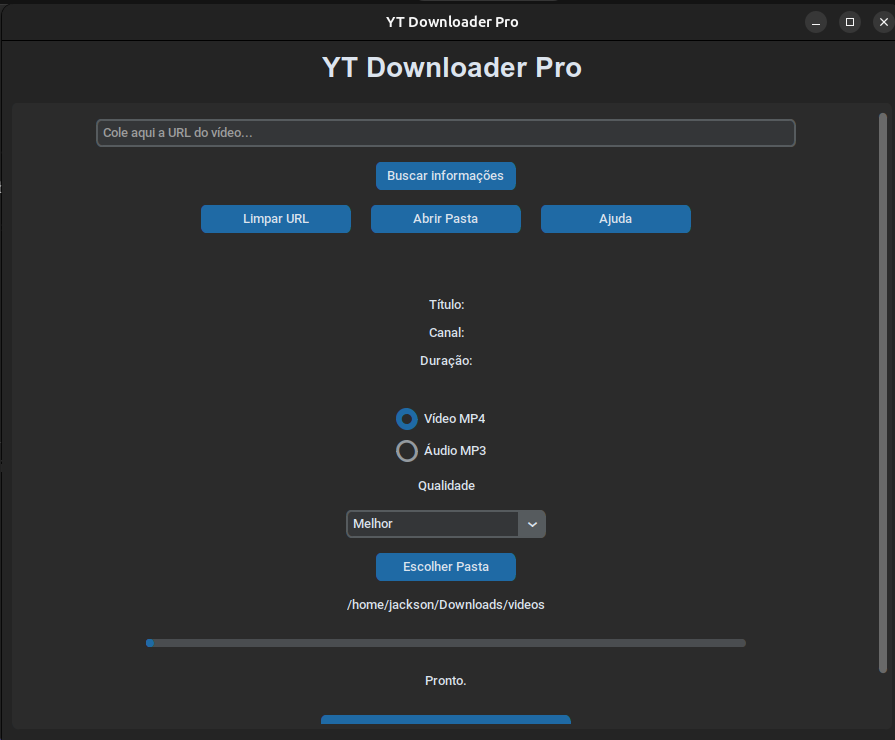
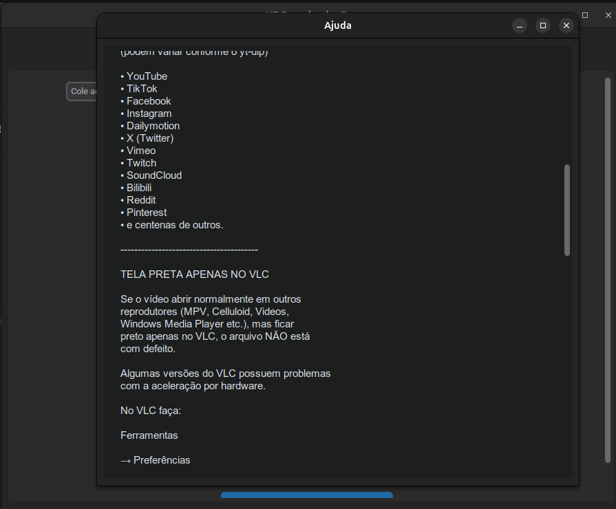

# YT Downloader Pro

Aplicativo gráfico desenvolvido em **Python**, utilizando **CustomTkinter** e **yt-dlp**, para baixar vídeos e áudios de centenas de sites suportados pelo yt-dlp.

---

## Capturas de tela

<p align="center">
  
  
</p>Adicione imagens da interface na pasta `screenshots/` e atualize esta seção.)

---

# Recursos

- Interface moderna desenvolvida com CustomTkinter
- Download de vídeos em MP4
- Download de áudio em MP3
- Busca automática das informações do vídeo
- Exibição da miniatura (thumbnail)
- Exibição do título
- Exibição do canal
- Exibição da duração
- Escolha da qualidade do vídeo
  - Melhor
  - 1080p
  - 720p
  - 480p
  - 360p
- Barra de progresso em tempo real
- Escolha da pasta de download
- Configuração salva automaticamente
- Histórico de downloads
- Botão para limpar a URL
- Botão para abrir a pasta de downloads
- Janela de ajuda integrada

---

# Sites suportados

O programa utiliza o **yt-dlp**, portanto suporta centenas de sites, incluindo:

- YouTube
- TikTok
- Facebook
- Instagram
- Dailymotion
- X (Twitter)
- Vimeo
- Twitch
- SoundCloud
- Reddit
- Pinterest
- Bilibili

e centenas de outros.

A disponibilidade depende do suporte atual do **yt-dlp**.

---

# Download

A versão mais recente pode ser baixada na página de **Releases** do projeto.

Arquivos disponíveis:

- Linux (.deb)
- Windows (.exe)

---

# Instalação (Linux)

Clone o projeto:

```bash
git clone https://github.com/jackson-077/yt-downloader-pro.git

cd yt-downloader-pro
```

Execute o instalador:

```bash
chmod +x install.sh
./install.sh
```

O instalador configura automaticamente:

- Python
- pip
- Ambiente virtual (venv)
- FFmpeg
- yt-dlp
- Dependências Python

---

# Executar

```bash
./run.sh
```

ou

```bash
python yt_downloader.py
```

---

# Sistemas suportados

- Linux (.deb)
- Windows (.exe)

---

## Downloads

Linux:
Baixe o arquivo `.deb` na página de Releases.

Windows:
Baixe o arquivo `.exe` na página de Releases.

---

# Tecnologias utilizadas

- Python
- CustomTkinter
- yt-dlp
- FFmpeg
- Pillow
- Requests

---

# Como usar

1. Copie a URL do vídeo.
2. Cole no campo de URL.
3. Clique em **Buscar informações**.
4. Escolha o formato:
   - MP4
   - MP3
5. Escolha a qualidade desejada.
6. Clique em **Baixar**.

---

# Observações

- Nem todos os sites oferecem todas as qualidades de vídeo.
- Alguns vídeos podem exigir autenticação.
- Alguns sites podem limitar downloads por região.
- O suporte aos sites depende do projeto **yt-dlp**.

Caso algum site deixe de funcionar:

```bash
pip install -U yt-dlp
```

---

# Problemas conhecidos

## Vídeo com tela preta apenas no VLC

Se o vídeo abrir normalmente em outros reprodutores (MPV, Celluloid, Videos, Windows Media Player etc.), o arquivo está correto.

Algumas versões do VLC apresentam incompatibilidade com determinados codecs quando a aceleração por hardware está ativada.

No VLC:

```
Ferramentas
→ Preferências
→ Entrada / Codecs
→ Decodificação acelerada por hardware
```

Altere para:

- Automático

ou

- Desativado

Depois reinicie o VLC.

---

# Aviso

Este programa utiliza o **yt-dlp** para acessar conteúdos públicos disponíveis na internet.

Respeite sempre os direitos autorais e os termos de uso das plataformas utilizadas.

---

# Licença

Este projeto está licenciado sob a licença MIT.

Consulte o arquivo `LICENSE` para mais informações.
---

# Autor

**Jackson Q.**

Desenvolvido com Python para facilitar o download de vídeos e áudios de diversas plataformas.
