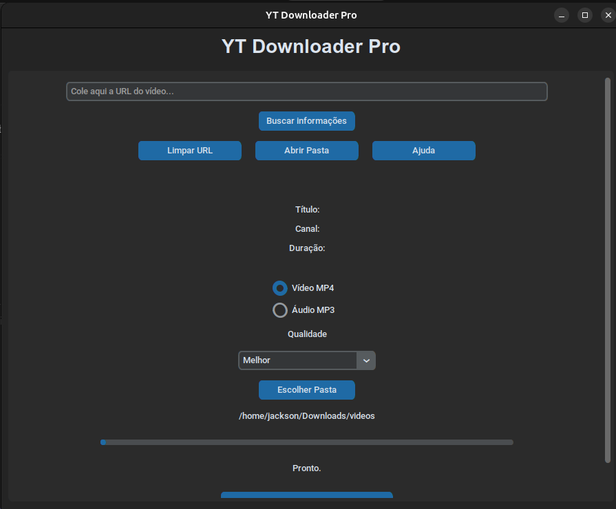
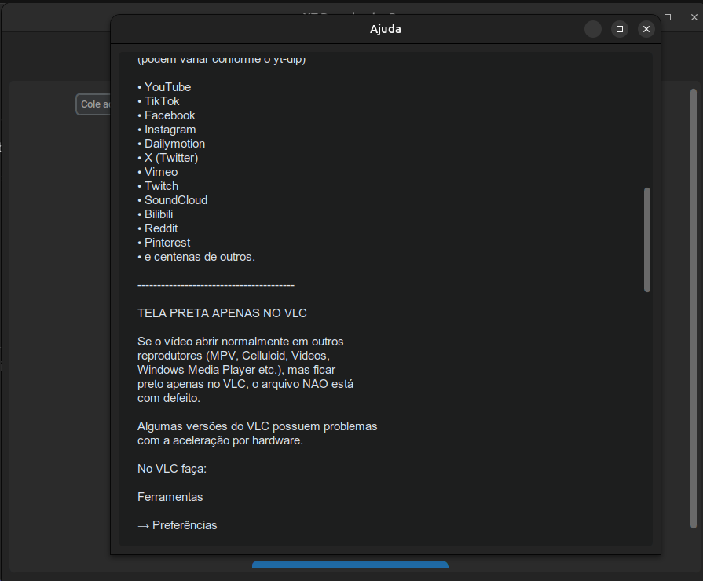

# YT Downloader Pro

<p align="center">

**Downloader gráfico para Windows e Linux utilizando Python + yt-dlp**

Baixe vídeos, músicas, playlists e áudios de centenas de sites de forma simples, rápida e totalmente gratuita.

</p>

---

# Capturas de tela

<p align="center">
  
  
</p>

> Adicione suas capturas de tela na pasta `screenshots/`.

---

# Recursos

O YT Downloader Pro foi desenvolvido para oferecer uma interface simples, moderna e intuitiva, permitindo baixar vídeos e áudios sem utilizar linha de comando.

## Interface

* Interface moderna desenvolvida com **CustomTkinter**
* Compatível com Windows e Linux
* Barra de progresso em tempo real
* Atualização automática do status durante o download
* Janela de ajuda integrada
* Interface simples e intuitiva

---

## Download de vídeos

* Download em MP4
* Download em MP3
* Escolha automática da melhor qualidade
* Seleção manual da qualidade

Qualidades disponíveis:

* Melhor disponível
* 1080p
* 720p
* 480p
* 360p

---

## Informações do vídeo

Antes do download o programa exibe automaticamente:

* Miniatura (Thumbnail)
* Título
* Nome do canal
* Duração
* Informações da playlist (quando aplicável)

---

## Playlists

Suporte para playlists do YouTube.

É possível escolher entre:

* Baixar toda a playlist em MP4
* Baixar toda a playlist em MP3
* Baixar apenas o vídeo selecionado

Cada playlist é organizada automaticamente em sua própria pasta.

---

## Gerenciamento

* Escolha da pasta de download
* Configuração salva automaticamente
* Histórico de downloads
* Botão para abrir a pasta
* Botão para limpar URL

---

## Compatibilidade automática

O programa procura automaticamente cookies nos principais navegadores quando necessário.

Navegadores suportados:

* Microsoft Edge
* Google Chrome
* Mozilla Firefox
* Brave
* Opera
* Vivaldi

Isso aumenta a compatibilidade com vídeos que exigem autenticação.

---

# Sites suportados

O programa utiliza o excelente projeto **yt-dlp**, suportando centenas de plataformas.

Entre elas:

* YouTube
* TikTok
* Facebook
* Instagram
* X (Twitter)
* Vimeo
* Twitch
* Reddit
* SoundCloud
* Dailymotion
* Bilibili
* Pinterest

...e centenas de outros serviços.

> A disponibilidade depende do suporte atual do yt-dlp.

---

# Download

A versão mais recente pode ser encontrada na página de **Releases**.

Arquivos disponíveis:

* Windows (.exe)
* Linux (.deb)

Não é necessário instalar Python para utilizar a versão Windows.

---

# Instalação (Linux)

Clone o projeto:

```bash
git clone https://github.com/jackson-077/yt-downloader-pro.git

cd yt-downloader-pro
```

Execute:

```bash
chmod +x install.sh
./install.sh
```

O instalador realiza automaticamente:

* Atualização do sistema
* Instalação do Python
* Instalação do pip
* Criação do ambiente virtual (venv)
* Instalação do FFmpeg
* Instalação do yt-dlp
* Instalação das dependências Python

---

# Executando

Via script:

```bash
./run.sh
```

Ou diretamente:

```bash
python yt_downloader.py
```

---

# Tecnologias utilizadas

* Python
* CustomTkinter
* yt-dlp
* FFmpeg
* Requests
* Pillow (PIL)
* browser-cookie3
* curl_cffi

---

# Como usar

1. Copie a URL do vídeo ou playlist.
2. Cole na caixa de texto.
3. Clique em **Buscar informações**.
4. Aguarde o carregamento.
5. Escolha:

* MP4
* MP3

6. Escolha a qualidade desejada.
7. Escolha a pasta de destino (opcional).
8. Clique em **Baixar**.

---

# Recursos de segurança

O programa:

* Não envia dados para servidores externos.
* Não exige login.
* Utiliza apenas bibliotecas abertas.
* Salva apenas configurações locais.
* Não coleta informações pessoais.

---

# Observações

* Algumas plataformas exigem autenticação.
* Alguns vídeos privados não podem ser baixados.
* Nem todos os sites disponibilizam todas as resoluções.
* A velocidade depende da sua conexão e do servidor da plataforma.
* Algumas plataformas podem alterar seu funcionamento ao longo do tempo.

Caso algum site deixe de funcionar:

```bash
pip install -U yt-dlp
```

---

# Problemas conhecidos

## Tela preta apenas no VLC

Se o vídeo abrir normalmente em outros reprodutores (MPV, Celluloid, Videos, Windows Media Player etc.), o arquivo está correto.

Algumas versões do VLC apresentam problemas com aceleração por hardware.

No VLC:

```
Ferramentas

→ Preferências

→ Entrada / Codecs

→ Decodificação acelerada por hardware
```

Selecione:

* Automático

ou

* Desativado

Depois reinicie o VLC.

---

# Estrutura do projeto

```
YT-Downloader-Pro/

├── yt_downloader.py
├── install.sh
├── run.sh
├── requirements.txt
├── README.md
├── screenshots/
├── icone.ico
├── LICENSE
└── dist/
```

---

# Contribuições

Sugestões, melhorias e correções são sempre bem-vindas.

Caso encontre algum problema, abra uma **Issue** ou envie um **Pull Request**.

---

# Agradecimentos

Este projeto utiliza diversas bibliotecas da comunidade Open Source.

Em especial:

* yt-dlp
* CustomTkinter
* FFmpeg
* Pillow

Obrigado aos desenvolvedores desses projetos.

---

# Aviso Legal

Este programa utiliza o **yt-dlp** para acessar conteúdos disponibilizados na internet.

Utilize-o de acordo com a legislação do seu país, respeitando direitos autorais, licenças e os termos de uso de cada plataforma.

---

# Licença

Este projeto está licenciado sob a licença **MIT**.

Consulte o arquivo `LICENSE` para mais informações.

---

# Autor

**Jackson Quequi**

Desenvolvido em Python com foco em simplicidade, praticidade e compatibilidade entre Windows e Linux.
